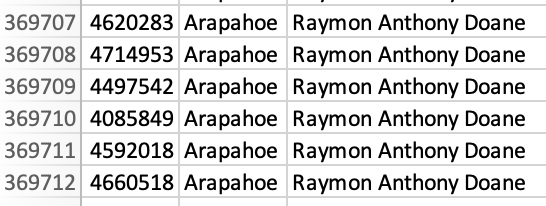

# election-analysis
Analyze election results using Python

### Table of Contents
- [1 Purpose](#1-purpose-of-election-analysis)
  - [1.1 Required Tools](#11-required-tools)
- [2 Election-Audit Results](#2-election-audit-results)
- [3 Election-Audit Summary](#3-election-audit-summary)

## 1 Purpose of Election Analysis
 
The purpose of this analysis was to assist a Colorado Board of Elections employee, Tom, in an election audit of tabulated results for U.S. Congressional Precinct in Colorado using Python to automate the process. Tom had requested to view the following information derived from the data: 

- Total number of votes
- Number of votes received for each candidate
- Percentage of votes received for each candidate
- Overall winner of the election 

Given that the results of this coding script were successful, the code generated for this analysis can be used to audit other congressional districts, senatorial districts, and local elections. 

### 1.1 Required Tools

- Python 3.7.6
- Visual Studio Code or equivalent text editor
- Microsoft Excel version 16 or newer

## 2 Election-Audit Results

### 2.1 Number of Votes Cast in the Congressional Election 

Based on the election analysis csv file and the image below, **369,711** votes were cast in the Congressional election:



To get the total number of votes cast using Python, the following code snippets were used to:
  1. Initialize the total vote counter and set it to **zero**
 
````total_votes = 0````

  2. Iterate through each row of the CSV file and add **one** vote for each row
  
````total_votes = total_votes + 1````

  3. Print results to the terminal and save to the election analysis text file

````with open(file_to_save, "w") as txt_file:````

````
election_results = (
f"\nElection Results\n"
f"-------------------------\n"
f"Total Votes: {total_votes:,}\n"
f"-------------------------\n\n"
f"County Votes:\n")
````

````print(election_results, end="")````

````txt_file.write(election_results)````


### 2.2 Breakdown of Number of Votes and Percentage of Total Votes for Counties in the Precinct

The three Colorado counties considered in this congressional analysis were Arapahoe, Denver, and Jefferson. Of the 369,711 total votes, **306,055** votes were from Denver county; **38,855** votes were cast in Jefferson county; and **24,801** votes were from Arapahoe. The percentage of total votes for each county in the precinct were **82.8%** for Denver, **10.5%** for Jefferson, and **6.7%** for Arapahoe: 

The following code snippets were used to derive these results: 

1. Create a county list and county votes dictionary
````
county_list = []
county_dict = {}
````

2. Extract the county name from each row
````
    county_name = row[1]
````
    
3. Write an if statement that checks that the county does not match any existing county in the county list

````
if county_name not in county_list:

            # Add the existing county to the list of counties.
            county_list.append(county_name)

            # Begin tracking the county's vote count.
            county_dict[county_name] = 0

        # Add a vote to that county's vote count.
        county_dict[county_name] += 1

# Save the results to our text file.
with open(file_to_save, "w") as txt_file:
````

4. Write a for loop to get the county from the county dictionary

````
for county_name in county_dict:

        # Retrieve the county vote count.
        county_votes = county_dict.get(county_name)
        # Calculate the percentage of votes for the county.
        county_vote_percentage = float(county_votes) / float(total_votes) * 100
````

6. Print the county results to the terminal and save the county votes to the election analysis text file
````
         # Print the county results to the terminal.
        county_results = (
            f"{county_name}: {county_vote_percentage:.1f}% ({county_votes:,})\n")

        print(county_results)
        
         # Save the county votes to a text file.
        txt_file.write(county_results)
 ````
### 2.3 County with Largest Number of Votes

**Denver County** had the largest number of votes/voter turnout in the election analysis. Using Python, the following code snippets were run to get the county with the most amount of casted votes: 

1. Track the largest county and county voter turnout
````
county_largest_turnout = ""
votes_largest_turnout = 0
````

2. Write an if statement to determine the winning county and get its vote count
````
        if (county_votes > votes_largest_turnout):
            votes_largest_turnout = county_votes
            county_largest_turnout = county_name
````
3. Print the county with the largest turnout to the terminal and save the results to the text file
````
winning_county_summary = (
        f"\n-------------------------\n"
        f"Largest County Turnout: {county_largest_turnout}\n"
        f"-------------------------\n")
    print(winning_county_summary)

    txt_file.write(winning_county_summary)
````

## 3 Election-Audit Summary
